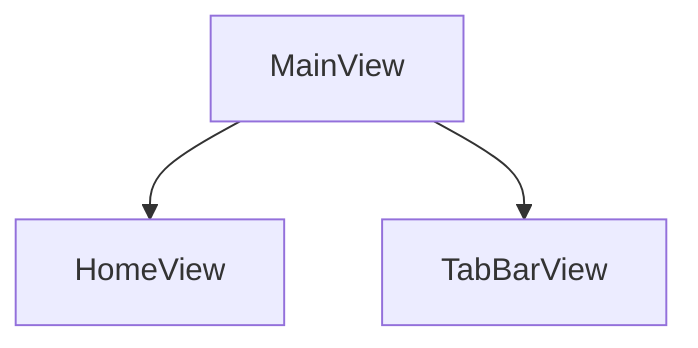
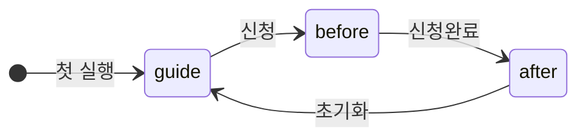
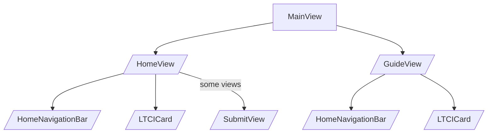

## 목적
사이드 프로젝트를 진행하면서 생긴 문제점과 그 문제를 해결한 과정을 팀원에게 공유하기 위해 이 글을 작성합니다.

## 문제상황 - 1
앱을 처음 사용하는 사람들을 위한 가이드화면을 그리기 위한 작업을 합니다. 가이드뷰은 반투명한 검은 배경에 처음 클릭해야하는 버튼을 지시하는 화면으로, ZStack을 이용해 뷰를 쌓으려 시도했습니다. 하지만 TabBar는 ZStack으로 쌓은 가이드뷰가 적용되지 않은 모습을 확인할 수 있었습니다.
<p align="center">
    
    <em style="display: block;">TabBar는 검은배경이 적용되지 않았다</em>
</p>


### 원인

_최상위에 `MainView`가 있고, 그 밑에 `HomeView`와 `TabBarView`가 있다._ 
가이드뷰를 `HomeView`에서 ZStack으로 쌓았기 때문에 `TabBarView`는 적용이 안되는 것을 확인할 수 있었습니다.


### 해결방안

HomeView에서 쌓은 가이드뷰를 MainView로 옮겨주면 간단하게 해결할 수 있습니다. 

<p align="center">
    
    <em style="display: block;">그림으로 그려본 ZStack 계층</em>
</p>

## 문제상황 - 2
`MainView`는 3가지의 상태를 가진다.


`guide`: 앱을 처음 실행할 때 나오는 가이드뷰가 나오는 상태
`before`: 서류제출을 하기 전의 상태
`after`: 서류제출이 끝난 상태

신청완료하는 시점에 View의 상태를 변경하기 위해서 그동안 생성자를 통한 명시적 의존성 주입 방식을 채택했습니다. 하지만 이 방법은 `MainView`의 상태에 의존하는 뷰가 많기 때문에 코드가 복잡해진다는 문제가 있습니다.

```swift
    SubmitView(mainViewModel: mainViewModel)
    // 생성자를 통한 명시적 의존성 주입
```

### MainViewModel를 의존하는 뷰들




### 해결방안
EnvironmentObject를 사용하여 뷰 계층 구조에서 의존성을 암시적으로 공유할 수 있도록 수정합니다. MainViewModel를 의존하는 뷰에 @EnvironmentObject 변수를 선언하면 사용할 수 있습니다.

```swift
struct SubmitView: View {
    @EnvironmentObject var mainViewModel: MainViewModel
    ...
```

EnvironmentObject를 사용하여 MainViewModel을 자식뷰가 암시적으로 의존할 수 있다는 장점이 있습니다.

## 마무리
자세한 코드는 [pull request](https://github.com/DeveloperAcademy-POSTECH/MacC-Team2-Nutty/pull/173)에서 확인할 수 있습니다. 


<br>

[jekyll-docs]: https://jekyllrb.com/docs/home
[jekyll-gh]:   https://github.com/jekyll/jekyll
[jekyll-talk]: https://talk.jekyllrb.com/
